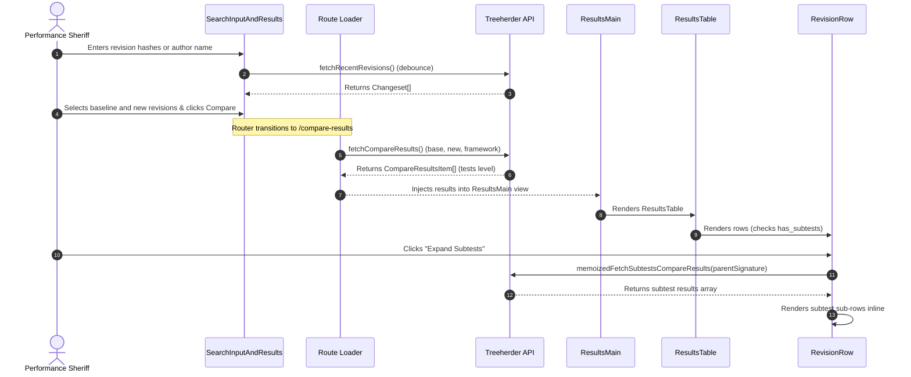
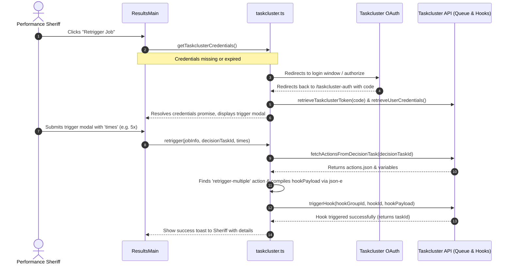

# Mozilla PerfCompare: Maintainer Onboarding & Study Plan

_Target Audience: Senior Engineer transitioning from Treeherder Maintainer to PerfCompare Maintainer_

Welcome to the Mozilla PerfCompare maintainer onboarding document! As an experienced Treeherder engineer, you already possess crucial context regarding Mozilla's automation, performance metrics, repository structure, and data pipelines. This guide is specifically designed to leverage your existing knowledge of Treeherder's databases, API structures, and task management systems to help you quickly master PerfCompare’s architecture and maintain its codebase confidently.

---

## Part 1: Purpose of PerfCompare & Why It Came Into Being

### The Problem

Historically, Mozilla ran performance tests (Talos, and later Browsertime, etc.) on every check-in to branches like `autoland` and `mozilla-central`. Developers and sheriffs faced several persistent hurdles when evaluating performance changes:

1. **High Noise / Variance:** Performance metrics collected in a shared virtual cloud or hardware environment suffer from inherent variance (noise). A minor change in a test's execution time could be normal noise or an actual regression.
2. **Lack of Statistical Rigor:** Sheriffs and developers had to manually "eyeball" graph shifts or rely on simple average-value percentage shifts to decide if a revision introduced a performance regression. This led to frequent false positives (wasted developer investigation time) and false negatives (regressions slipping into production).
3. **Complex Multi-modal Data:** Modern performance test distributions (especially for web-page loading tests) are often non-normal and multi-modal (containing multiple distinct peak behaviors). Standard parametric tests like Student's T-Test perform poorly or give misleading results under these conditions.
4. **Subtest Explosion:** Tests often contain hundreds of individual subtests (e.g., page loading times for individual domains). Spotting which specific subtest regressed was like finding a needle in a haystack.

### The Solution: PerfCompare

PerfCompare was created as a standalone interactive visualizer to bring **statistical rigor** to the performance evaluation process:

- **Parametric & Non-Parametric Analyses:** It supports both standard Student's T-test and the non-parametric Mann-Whitney U test.
- **Effect Size Calculations:** It integrates advanced metrics such as Cliff’s Delta and Common Language Effect Size (CLES) to give engineers a practical sense of the scale of performance shifts.
- **Kernel Density Estimation (KDE) and Silverman’s Multimodality Test:** It plots full probability distributions for run results, revealing bi-modal or multi-modal behavior shifts that simple averages hide.
- **On-Demand Retriggering:** It directly integrates with Taskcluster to let sheriffs instantly retrigger jobs to gather more runs (replicates), reducing statistical uncertainty.

---

## Part 2: High-Level Architecture (System Context)

PerfCompare is a specialized frontend analytical Single Page Application (SPA) designed to compare performance metrics generated by Mozilla's CI systems.

### System Context Diagram

```
+---------------------------------------------------------------------------------+
|                                 PerfCompare App                                 |
|                                                                                 |
|  +-----------------------------+              +------------------------------+  |
|  |                             |              |                              |  |
|  |     Search & Select UI      +------------->|     Results & Metrics UI     |  |
|  |                             |              |                              |  |
|  +--------------+--------------+              +--------------+---------------+  |
+-----------------|--------------------------------------------|------------------+
                  |                                            |
                  |                                            |
                  v                                            v
+-----------------+--------------------+     +-----------------+------------------+
|            Treeherder API            |     |         Taskcluster Server         |
|  (e.g. treeherder.mozilla.org/api/)  |     |   (firefox-ci-tc.services.m.o)     |
|                                      |     |                                    |
|  - Revision Lookup / Pushes          |     |  - OAuth 2.0 / User Credentials    |
|  - Compare Results & Subtests        |     |  - Job Retriggering Hooks          |
|  - Job Information / Decision Tasks  |     |  - Hook triggers via json-e        |
+--------------------------------------+     +------------------------------------+
```

### Relationship with Treeherder and Taskcluster

As a Treeherder developer, you are accustomed to how Treeherder ingests jobs, platforms, and performance results. PerfCompare acts as a _consumer_ and an _interactive visualizer_ of these services.

1. **Treeherder API Integration:**
   - **Revisions & Pushes:** PerfCompare queries `/api/project/{repository}/push/` to find recent push revisions, authors, and commits.
   - **PerfCompare Endpoints:** Treeherder has dedicated backend endpoints specifically built for this frontend:
     - `/api/perfcompare/results/`: Evaluates and returns statistical differences between baseline and new revisions (or over time).
     - `/api/project/{repo}/hash/tocommit/`: Translates raw trial/temporary hashes to actual commits.
     - `/api/project/{repo}/jobs/{jobId}/`: Queries job-specific metadata to map runs back to tasks.
2. **Taskcluster Integration:**
   - **Authentication:** Authenticates users via Taskcluster's OAuth client Flow (`/login/oauth/authorize/`).
   - **Retriggering Jobs:** When a sheriff wants to reduce noise or confirm a regression, they can retrigger performance test jobs directly from PerfCompare. PerfCompare fetches actions (`public/actions.json`) from the decision task, resolves variables via `json-e` template parsing, and invokes Taskcluster Hooks API (`hooks:trigger-hook:*`) with user credentials to start new job replicas.

---

## Part 3: Deep Dive into Treeherder & Taskcluster Backend Queries

To confidently maintain PerfCompare, you must understand exactly which **Django Apps**, **REST APIs**, and **Database Tables** in Treeherder and Taskcluster are queried by the frontend.

### 1. Treeherder Database Schema & Django Apps

The core performance-comparison backend logic is housed within Treeherder's repository. The following Django apps and relational database tables are directly relevant:

#### A. Django Apps inside Treeherder

- **`treeherder.perfcompare`**:
  - This is the dedicated Django app implementing backend statistics and REST API controllers for PerfCompare.
  - It performs the heavy lifting: fetches baseline and target performance runs from the database, runs statistical checks (Student-T, Mann-Whitney U, Cliff's Delta, Silverman KDE, CLES), and packages them into unified JSON payloads.
- **`treeherder.model`**:
  - Contains the core models representing Mozilla's ingestion pipelines, including jobs, repositories, pushes, and performance data.
- **`treeherder.api`**:
  - Exposes standard resources like push sequences, job definitions, and project configurations.

#### B. Relational Database Tables in Treeherder SQL (MySQL/PostgreSQL)

When PerfCompare requests comparisons, Treeherder queries and joins several key relational tables:

| Database Table              | Purpose                                                                                                                              | Core Fields Used                                                                                                                             |
| --------------------------- | ------------------------------------------------------------------------------------------------------------------------------------ | -------------------------------------------------------------------------------------------------------------------------------------------- |
| **`performance_signature`** | Holds unique hashes identifying a specific test configuration. If a performance test has a subtest, it points to a parent signature. | `id`, `signature` (SHA256 string), `parent_signature_id` (null for main suites, non-null for subtests), `suite_id`, `test_id`, `platform_id` |
| **`performance_datum`**     | Stores raw numerical values collected from running tests (e.g. milliseconds, FPS, memory bytes).                                     | `id`, `job_id` (foreign key), `signature_id` (foreign key), `value` (double), `replicate_index` (int)                                        |
| **`job`**                   | Tracks execution status and identifiers of test runs produced by Taskcluster.                                                        | `id`, `task_id` (Taskcluster UUID), `job_type_id`, `push_id` (foreign key), `status`                                                         |
| **`push`**                  | Stores code push details and maps them to a specific author.                                                                         | `id`, `revision` (Git SHA), `author`, `push_timestamp`, `repository_id` (foreign key)                                                        |
| **`repository`**            | Keeps track of repositories in Mozilla CI (e.g. try, autoland).                                                                      | `id`, `name` (e.g., 'autoland', 'try')                                                                                                       |

---

### 2. Taskcluster APIs & Endpoints Queried

When performing job retrigger actions, PerfCompare bypasses Treeherder to directly query and command the **Taskcluster** cluster. It integrates with the following services and endpoints:

1. **OAuth 2.0 / Authentication**:
   - **Endpoint:** `GET {rootUrl}/login/oauth/authorize/`
   - **Endpoint:** `POST {rootUrl}/login/oauth/token`
   - **Endpoint:** `GET {rootUrl}/login/oauth/credentials`
   - **Purpose:** Handles single sign-on using Mozilla credentials and retrieves temporary access tokens to authorize sheriff commands.
2. **Task Group Artifacts (Queue API)**:
   - **Endpoint:** `GET {rootUrl}/api/queue/v1/task/{decisionTaskId}/artifacts/public%2Factions.json`
   - **Purpose:** Downloads the `actions.json` list associated with the decision task. This file outlines what hooks (like `retrigger-multiple`) can be launched on this push and what variables are needed.
3. **Hooks API (Trigger Hook)**:
   - **Endpoint:** `POST {rootUrl}/api/hooks/v1/trigger-hook/{hookGroupId}/{hookId}`
   - **Purpose:** Triggers the selected Taskcluster hook, carrying the variable payload resolved through `json-e` template mapping.

---

## Part 4: Low-Level Architecture & Technical Stack

PerfCompare is built using a modern React, Redux Toolkit, TypeScript, and Material UI (MUI) stack. It is compiled and optimized via Webpack and deployed as a static Single Page Application (SPA) on Netlify.

### 1. Routing & Route Loaders (`src/components/App.tsx`)

PerfCompare utilizes `react-router` with a static routing model. Before rendering any route's main view, the router runs corresponding **loaders** to fetch data. This decouples API calling logic from components:

- **`/` (SearchView):** Loaders verify query parameters (e.g. `baseRepo`, `baseRev`) to pre-select revisions.
- **`/compare-results` (ResultsView):** Fetches compared results between baseline and new revisions from Treeherder's `/api/perfcompare/results/` endpoint via `src/components/CompareResults/loader.ts`.
- **`/compare-hash-results`:** Uses `hashToCommitLoader` to resolve temporary hashes to commit hashes before fetching comparison metrics.
- **`/compare-lando-results`:** Integrates with Lando to fetch commit details from landing revisions.
- **`/subtests-compare-results`:** Loads subtest performance comparisons using parent signatures.

### 2. State Management & Redux Slices (`src/reducers/`)

State management is kept simple and deterministic using Redux Toolkit:

- **`ThemeSlice.ts`:** Handles light/dark themes (`'light' | 'dark'`), persists user selection, and updates MUI's `ThemeProvider`.
- **`SelectedRevisionsSlice.ts`:** Manages the selected baseline/new revisions (`Changeset[]`) before triggering the comparative run.
- **`ComparisonSlice.ts`:** Manages the active visual option, such as whether we are showing all tests or filtered views.

### 3. Key UI Components & Component Structure (`src/components/`)

- **`Search/` (Revision Search):**
  - `SearchInputAndResults.tsx`: The primary input component. Uses an Autocomplete component powered by custom debounce utilities to query Treeherder's push API dynamically as the user types a hash or an author's name.
  - `SelectedRevisions.tsx`: Displays list of chosen revisions to be compared.
- **`CompareResults/` (Visualizing Results):**
  - `ResultsMain.tsx` / `ResultsView.tsx`: Consumes comparison arrays, manages table visual state, rendering either standard Student-T or Mann-Whitney U statistical comparison sheets.
  - `ResultsTable.tsx`: A highly optimized tabular viewer designed to render large tables of performance measurements.
  - `RevisionRow.tsx` / `RevisionRowExpandable.tsx`: Individual test signature rows. Supports nested expanding lines to fetch and display subtests inline using Virtuoso windowing elements.
  - `SubtestsResults/`: Handles display of subtests, where parent signatures indicate nested subtest metrics.
  - `Retrigger/`: Houses the auth button and triggers to launch duplicate runs on Taskcluster.

### 4. Styles & Theme (`src/styles/` & `src/theme/`)

- **Theme System:** Fully standard MUI theme structure combined with custom design tokens (`src/theme/protocolTheme.ts`).
- **CSS-in-JS:** Uses `typestyle` extensively for fine-grained style controls, encapsulated hover/active behaviors, and CSS-grid column layouts.

### 5. API Client Layer (`src/logic/`)

- **`treeherder.ts`:** Clean fetch wrapper with robust error-handling mapping specifically to Treeherder's payload formats. Features a custom map-based cache to memoize subtest requests to prevent duplicate requests when scrolling complex results.
- **`taskcluster.ts`:** Handles OAuth callback handlers, token creation, `json-e` variable compilation, and Hook triggers.
- **`credentials-storage.ts`:** Implements secure local/session storage helper functions to persist temporary Taskcluster Bearer tokens securely across sub-domains and redirect windows.

---

## Part 5: Component Interaction Diagrams

To understand how data flows across the system, let's look at the two most critical developer user journeys: **Comparing Revisions** and **Retriggering jobs via Taskcluster**.

### 1. Search, Compare, and Subtest Visualization Sequence

This flow details how user selections resolve into structured statistical data, and how nested subtests are fetched lazily.



### 2. Taskcluster Authentication & Job Retriggering Sequence

This flow describes the OAuth redirect flow and the resolution of hook actions to execute retrigger requests safely.



---

## Part 6: Core Differences for a Treeherder Maintainer

As a maintainer of Treeherder, you will find several key differences when working on the PerfCompare codebase:

| Architecture Aspect      | Treeherder                                                                                                                                                           | PerfCompare                                                                                                                                                                                                  |
| ------------------------ | -------------------------------------------------------------------------------------------------------------------------------------------------------------------- | ------------------------------------------------------------------------------------------------------------------------------------------------------------------------------------------------------------ |
| **System Scope**         | Full stack application with a heavy Django-based relational backend (MySQL/PostgreSQL), ingestion queue workers, task monitors, and a legacy Angular/React frontend. | Pure Single Page Application (SPA). There is **no custom backend database** or custom server; all application states are fully handled in the frontend or directly delegated to Treeherder/Taskcluster APIs. |
| **Backend Dependencies** | Django, celery workers, database schema migrations, schema optimizations, complex indexing.                                                                          | None. Simple, standard Node.js development server to compile and run tests.                                                                                                                                  |
| **Performance Data**     | Focuses on ingesting, storing, and organizing job structures, artifact links, and massive logs.                                                                      | Focuses on comparative mathematics (Student-T, Mann-Whitney U, Silverman KDE, Cliff's Delta, Common Language Effect Size (CLES)) and visualizing kernel density estimation plots.                            |
| **State Paradigm**       | Angular services and multi-store component-bound patterns.                                                                                                           | Modern Redux Toolkit slice architecture with React Router loaders resolving async actions before initial mounting.                                                                                           |
| **Styling Conventions**  | Scattered SCSS / Bootstrap CSS and CSS Modules.                                                                                                                      | Unified Material UI (MUI) custom design theme with modern `typestyle` styling classes.                                                                                                                       |

---

## Part 7: Maintainer Study & Onboarding Plan

This plan is structured over 4 weeks to move you systematically from initial exploration to production code-review capabilities.

### Week 1: Environment & Architecture Foundations

- **Goals:**
  - Get your local environment fully configured and understand the main routing entry points.
  - Understand the dual testing methodology (Student-T vs Mann-Whitney U) in the UI.
- **Reading List:**
  - Read `README.md` and `Deployment.md`.
  - Read `src/components/App.tsx` and trace route paths to their respective folder loaders (`loader.ts`).
  - Read `src/types/state.ts` to understand how `CompareResultsItem` and `MannWhitneyResultsItem` shapes model the mathematical comparisons.
- **Action Items:**
  1. Clone the repository and install node modules: `npm install`.
  2. Start the local dev server: `npm run dev` and navigate to `http://localhost:3000`.
  3. Run the full validator suite: `npm run test-all`.
  4. Experiment with fulltext search flag by appending `?useFulltextSearch=true` to your local development instance URL.
- **Discussion Topic with mentor:** Discuss the difference between the legacy `SearchInput.tsx` component and the current Autocomplete-driven `SearchInputAndResults.tsx`.

### Week 2: Deep Dive into Comparative Mathematical Views & UI Components

- **Goals:**
  - Understand how performance data is displayed, sorted, and filtered.
  - Gain mastery over MUI tables, custom styling structures (`typestyle`), and the virtouso virtual scrolling.
- **Reading List:**
  - Trace the hierarchy of components in `src/components/CompareResults/`.
  - Study `src/components/CompareResults/ResultsTable.tsx` to understand the generic table definition type `TableConfig`.
  - Explore how search results are constructed in `src/components/CompareResults/ResultsMain.tsx`.
- **Action Items:**
  1. Modify a minor rendering styling class in `src/components/CompareResults/TableHeader.tsx` using `typestyle` and observe hot-reloads.
  2. Create a test mockup inside `src/mockData/` and trace how mock revisions are loaded when testing comparisons.
  3. Run `npm run test:watch` while making changes to understand how jest snapshots work. Update snapshot tests when required with `npm run test:update`.
- **Discussion Topic with mentor:** Explain how column filters (`MatchesFunction`) and sort algorithms (`SortFunction`) are decoupled from specific mathematical run structures using generic interfaces in `src/types/types.ts`.

### Week 3: Integration with Taskcluster OAuth & Hook Triggers

- **Goals:**
  - Master the OAuth login lifecycle with Taskcluster.
  - Understand how jobs are retriggered and how the client parses task specifications via `json-e`.
- **Reading List:**
  - Study `src/logic/taskcluster.ts` and `src/components/TaskclusterAuth/TaskclusterCallback.tsx`.
  - Study the `retrigger` function parameters and flow.
  - Review how credentials are saved in `src/logic/credentials-storage.ts`.
- **Action Items:**
  1. Set up standard Taskcluster staging configurations in your local browser storage.
  2. Trace a full step-by-step path of an action payload construction inside `retrigger()` and write unit tests to mock its outputs.
  3. Check the client configurations in `tcClientIdMap` to see how localhost, main, and production URLs map to specific client IDs.
- **Discussion Topic with mentor:** Walk through how `json-e` resolves the action variables dynamically from decision tasks, and how to debug failing Taskcluster Hook triggers.

### Week 4: Release Management, Testing, & First Contribution

- **Goals:**
  - Understand our Netlify deployment process.
  - Master unit and snapshot tests with React Testing Library and Jest.
  - Land your first pull request.
- **Reading List:**
  - Read `Deployment.md` thoroughly.
  - Review open issues on Bugzilla in Testing::PerfCompare.
- **Action Items:**
  1. Find a beginner-friendly bug on Bugzilla, assign it to yourself, or pick an existing minor refactoring issue in PerfCompare.
  2. Implement the changes, writing Jest unit tests where necessary.
  3. Validate your code by running `npm run fix-all` (which runs Prettier, ESLint, and updates snapshots).
  4. Ensure everything compiles perfectly and passes checks: `npm run test-all`.
  5. Commit and open your Pull Request against the `main` branch following our commit message guidelines:
     `Bug-XXX: Short description of the issue being fixed`
- **Discussion Topic with mentor:** Congratulations! You are now ready to be a co-maintainer of the repository. Let's review the code-review guidelines, standard branch-merge patterns (merge commits over squashing/rebasing on release branches), and production release schedules.
